# North Shore AI Architecture

> Interactive version: [nsai.space/architecture](https://nsai.space/architecture.html)

This document provides architectural diagrams for the NSAI ecosystem. All diagrams are auto-generated from repository metadata and dependency analysis.

---

## Table of Contents

1. [System Overview](#system-overview)
2. [7-Tier Architecture](#7-tier-architecture)
3. [Crucible Reliability Stack](#crucible-reliability-stack)
4. [CNS Dialectical Reasoning](#cns-dialectical-reasoning)
5. [Metalworking Data Pipeline](#metalworking-data-pipeline)
6. [MLOps Pipeline](#mlops-pipeline)
7. [Infrastructure Layer](#infrastructure-layer)
8. [Cross-Cutting Dependencies](#cross-cutting-dependencies)

---

## System Overview

High-level view of all major subsystems and their relationships:

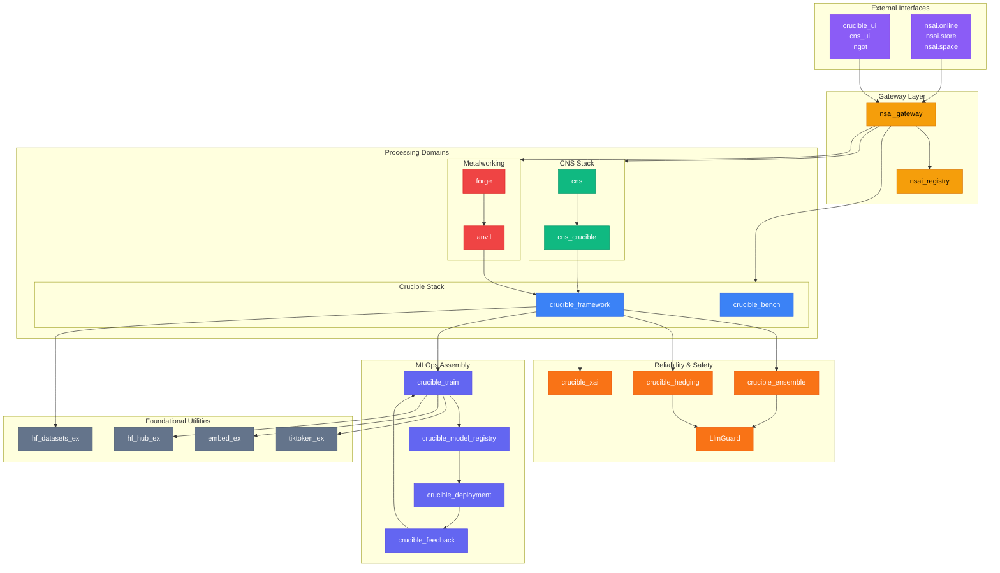

---

## 7-Tier Architecture

The ecosystem is organized into seven distinct tiers, from user-facing interfaces down to foundational utilities:

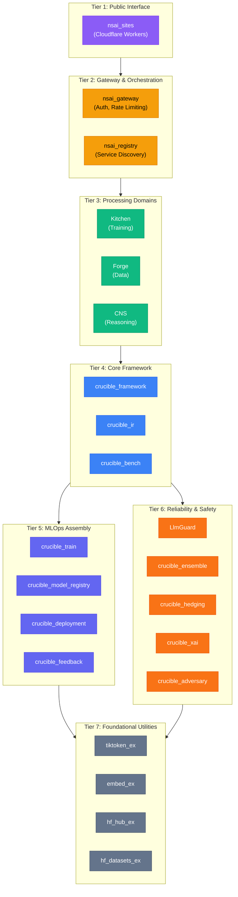

---

## Crucible Reliability Stack

The core ML experimentation and reliability platform:

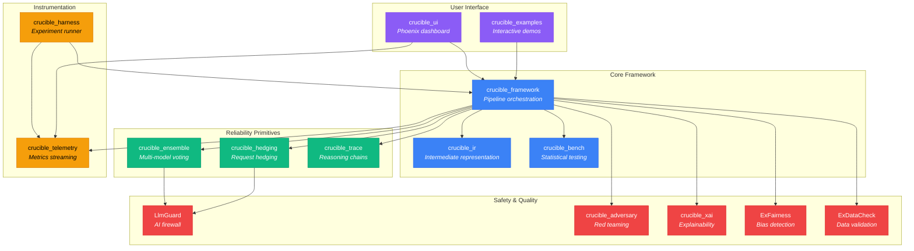

### Voting Strategies

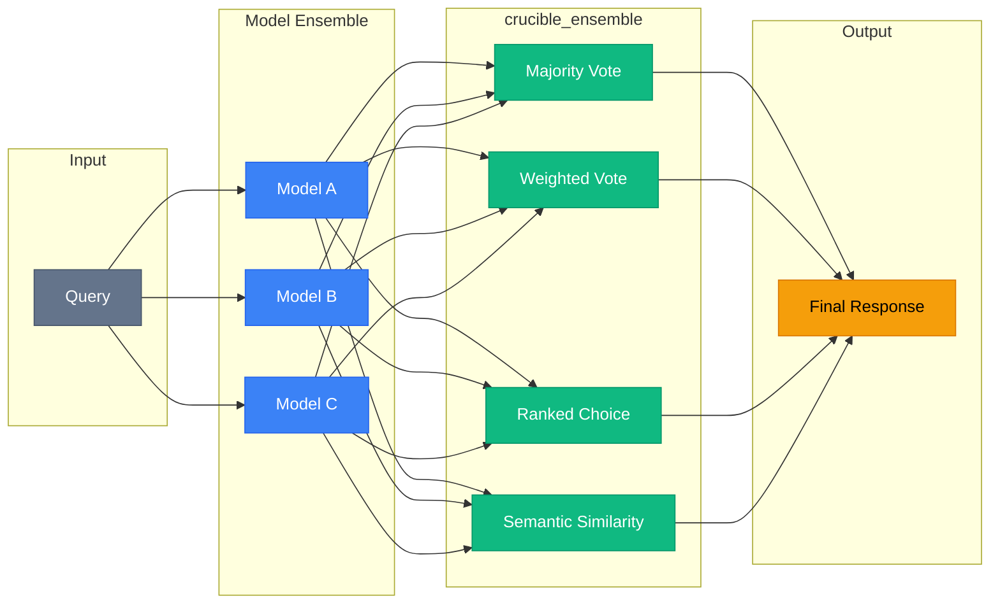

### Hedging Strategies

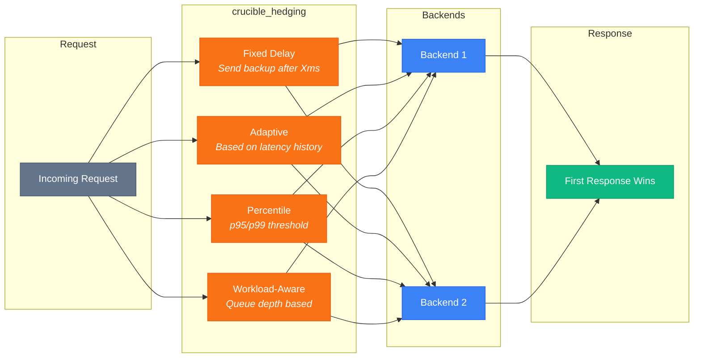

---

## CNS Dialectical Reasoning

Chiral Narrative Synthesis for structured argumentation:

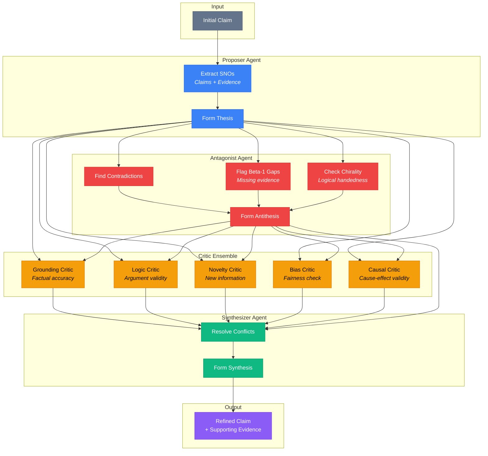

### SNO Graph Structure

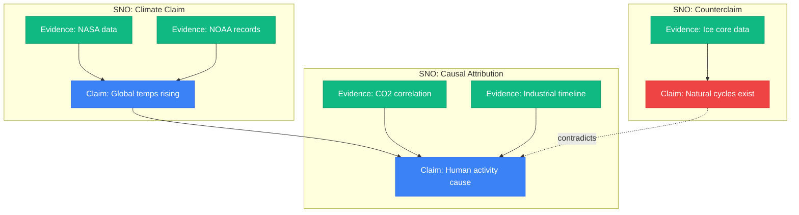

---

## Metalworking Data Pipeline

The data labeling stack using metalworking metaphors:

```mermaid
flowchart LR
    subgraph Raw["Raw Materials"]
        DATA[Unstructured Data<br/><i>Text, images, audio</i>]
    end

    subgraph Forge["Forge (forge)"]
        F_INGEST[Ingest]
        F_PARSE[Parse]
        F_SAMPLE[Generate Samples]
        F_TRANSFORM[Transform]
    end

    subgraph Anvil["Anvil (anvil)"]
        A_QUEUE[Label Queue]
        A_ASSIGN[Assignment]
        A_LABEL[Human Labeling]
        A_QC[Quality Control]
        A_IRR[Inter-Rater Reliability<br/><i>Cohen's Kappa</i>]
    end

    subgraph Ingot["Ingot (ingot)"]
        I_UI[Phoenix LiveView UI]
        I_REVIEW[Review Interface]
        I_EXPORT[Export Tools]
    end

    subgraph Crucible["Crucible (experimentation)"]
        C_TRAIN[Training]
        C_EVAL[Evaluation]
    end

    DATA --> F_INGEST --> F_PARSE --> F_SAMPLE --> F_TRANSFORM
    F_TRANSFORM --> A_QUEUE --> A_ASSIGN --> A_LABEL --> A_QC --> A_IRR
    A_IRR --> I_UI
    I_UI --> I_REVIEW --> I_EXPORT
    I_EXPORT --> C_TRAIN --> C_EVAL
    C_EVAL -.->|feedback| A_QUEUE

    classDef raw fill:#64748b,stroke:#475569,color:#fff
    classDef forge fill:#ef4444,stroke:#dc2626,color:#fff
    classDef anvil fill:#f59e0b,stroke:#d97706,color:#000
    classDef ingot fill:#10b981,stroke:#059669,color:#fff
    classDef crucible fill:#3b82f6,stroke:#2563eb,color:#fff

    class DATA raw
    class F_INGEST,F_PARSE,F_SAMPLE,F_TRANSFORM forge
    class A_QUEUE,A_ASSIGN,A_LABEL,A_QC,A_IRR anvil
    class I_UI,I_REVIEW,I_EXPORT ingot
    class C_TRAIN,C_EVAL crucible
```

---

## MLOps Pipeline

Training infrastructure using the Kitchen metaphor:

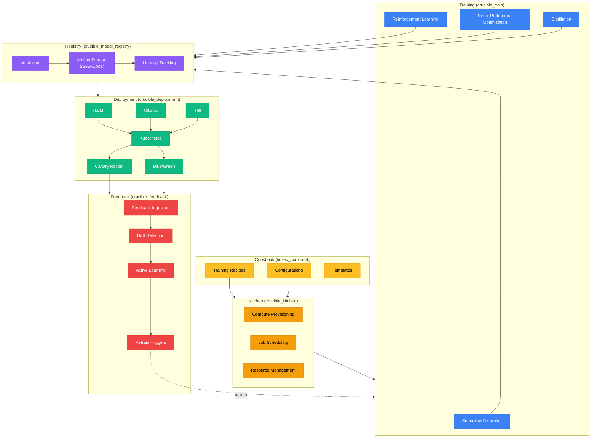

---

## Infrastructure Layer

Gateway, service discovery, and cross-cutting concerns:

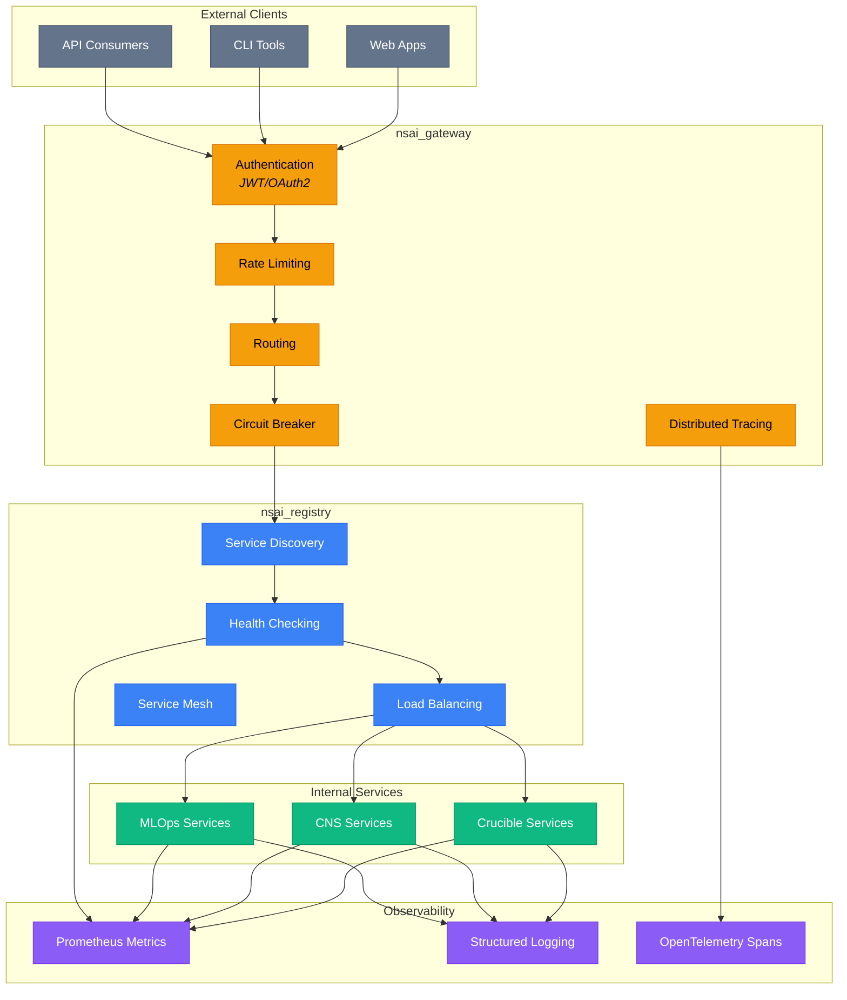

---

## Cross-Cutting Dependencies

Shared utilities used across all subsystems:

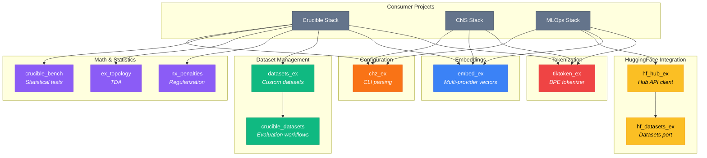

---

## Legend

| Color | Meaning |
|-------|---------|
| 🟦 Blue | Core framework / primary components |
| 🟩 Green | Synthesis / output / success paths |
| 🟥 Red | Antagonist / safety / critical checks |
| 🟨 Yellow/Orange | Gateway / infrastructure / warnings |
| 🟪 Purple | Interface / user-facing / telemetry |
| ⬜ Gray | External / input / utilities |

---

## Auto-Generation

This document is auto-generated by `scripts/generate_architecture.sh`. To regenerate:

```bash
./scripts/generate_architecture.sh
```

The script parses:
- Repository topics (`nshkr-*` labels)
- `mix.exs` dependency declarations
- README category mappings

---

_Last updated: 2025-12-29_
