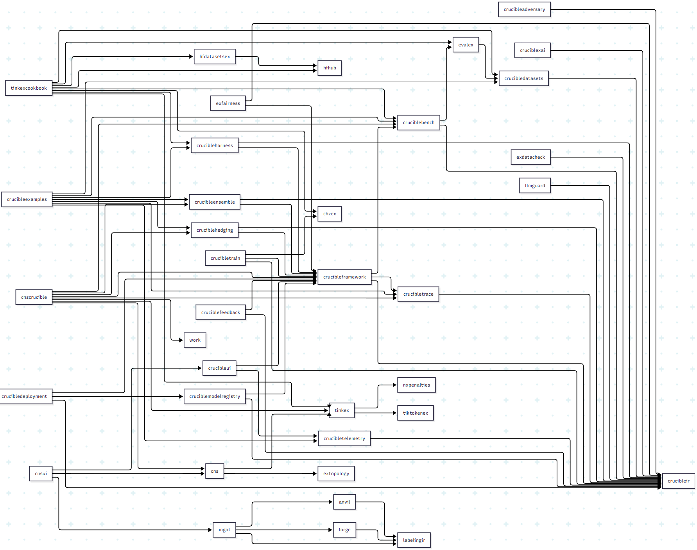

# North Shore AI

**Reliability-first AI infrastructure on Elixir/BEAM**

**50+ public repos**

---

## Executive Summary

The Elixir/BEAM platform provides technical capabilities essential for production AI systems that other runtimes cannot match: lightweight process isolation enables thousands of concurrent model calls without shared state corruption, supervisor trees provide automatic failure recovery without human intervention, and hot code upgrades allow model updates without service interruption. These are not conveniences but prerequisites for systems targeting 99%+ reliability in adversarial production environments.

North Shore AI builds the ML reliability research ecosystem that Elixir deserves. From statistical testing and ensemble voting to adversarial robustness and explainable AI, the stack addresses the full lifecycle of getting LLMs to behave predictably. The goal is world-class tooling that leverages BEAM's unique properties while remaining accessible to researchers and practitioners.

Two industrial metaphors unify the ecosystem. The **Kitchen/Cookbook** pattern treats ML training as a culinary operation: the kitchen provides infrastructure, cookbooks contain recipes, and practitioners are chefs executing them. The **Metalworking** pattern treats data labeling as manufacturing: raw data enters the forge, receives careful refinement on the anvil, and emerges as polished UI components (ingots) ready for crucible experimentation.

---

## The 7-Tiered Architectural Model

| Tier | Layer | Components |
|------|-------|------------|
| 1 | Public Interface | nsai_sites (Cloudflare Workers) |
| 2 | Gateway & Orchestration | nsai_gateway, nsai_registry |
| 3 | Processing Domains | Kitchen (training), Forge (data), CNS (reasoning) |
| 4 | Core Framework | crucible_framework, crucible_ir, crucible_bench |
| 5 | MLOps Assembly | crucible_train, crucible_model_registry, crucible_deployment, crucible_feedback |
| 6 | Reliability & Safety | LlmGuard, crucible_ensemble, crucible_hedging, crucible_xai, crucible_adversary |
| 7 | Foundational Utilities | tiktoken_ex, embed_ex, hf_hub_ex, hf_datasets_ex |

---



---

## Industrial Metaphors

### Kitchen/Cookbook (Training Infrastructure)

The training stack uses culinary terminology to separate concerns:

- **Kitchen** (`crucible_kitchen`): The infrastructure and orchestration engine. Backend-agnostic, handles compute provisioning, job scheduling, and resource management.
- **Cookbook** (`tinkex_cookbook`): Training recipes and configurations. Declarative specifications for training runs that can be versioned and shared.
- **Chef**: The ML practitioner who uses the kitchen and follows recipes to produce trained models.

### Metalworking (Data Labeling Stack)

The data labeling pipeline uses metalworking terminology to describe data transformation:

- **Forge** (`forge`): Raw data processing factory. Takes unstructured inputs and shapes them into structured samples.
- **Anvil** (`anvil`): Human-in-the-loop labeling and governance. Where careful refinement and quality control occur.
- **Ingot** (`ingot`): Polished UI components. Production-ready Phoenix LiveView modules for labeling interfaces.
- **Crucible**: ML experimentation. Where refined data undergoes testing and transformation under pressure.

---

## Core Projects by Category

### Crucible Reliability Stack

Open research platform targeting 99%+ LLM reliability through ensembles, hedging, and statistical testing.

| Repository | Description |
|------------|-------------|
| [crucible_framework](https://github.com/North-Shore-AI/crucible_framework) | ML experimentation orchestration, pipeline runner, stage definitions |
| [crucible_ir](https://github.com/North-Shore-AI/crucible_ir) | Intermediate representation for ML pipelines (experiment, stage_def, reliability configs) |
| [crucible_bench](https://github.com/North-Shore-AI/crucible_bench) | Statistical testing (t-tests, ANOVA, effect sizes, power analysis, normality tests) |
| [crucible_ensemble](https://github.com/North-Shore-AI/crucible_ensemble) | Multi-model voting (majority, weighted, ranked-choice, semantic similarity) |
| [crucible_hedging](https://github.com/North-Shore-AI/crucible_hedging) | Request hedging strategies (fixed, adaptive, percentile, workload-aware) |
| [crucible_harness](https://github.com/North-Shore-AI/crucible_harness) | Experiment orchestration, progress tracking, report generation (HTML/LaTeX/Jupyter) |
| [crucible_telemetry](https://github.com/North-Shore-AI/crucible_telemetry) | Research-grade instrumentation, metrics streaming, CSV/JSONL export |
| [crucible_trace](https://github.com/North-Shore-AI/crucible_trace) | Causal reasoning chain logging, Mermaid diagram export |
| [crucible_xai](https://github.com/North-Shore-AI/crucible_xai) | Explainable AI (LIME, SHAP, PDP/ICE, feature attribution, faithfulness validation) |
| [crucible_ui](https://github.com/North-Shore-AI/crucible_ui) | Phoenix dashboard for ML experiments, ensemble/hedging visualization, telemetry streaming |
| [crucible_examples](https://github.com/North-Shore-AI/crucible_examples) | Interactive demos with mock LLM system (ensemble voting, hedging, stats, tracing) |

### MLOps Pipeline

| Repository | Description |
|------------|-------------|
| [crucible_train](https://github.com/North-Shore-AI/crucible_train) | Unified ML training (supervised, RL, DPO, distillation, multi-backend logging) |
| [crucible_model_registry](https://github.com/North-Shore-AI/crucible_model_registry) | Model versioning, artifact storage (S3/HF/local), lineage graphs |
| [crucible_deployment](https://github.com/North-Shore-AI/crucible_deployment) | Model deployment (vLLM/Ollama/TGI/K8s), canary/blue-green rollouts |
| [crucible_feedback](https://github.com/North-Shore-AI/crucible_feedback) | Production feedback ingestion, drift detection, active learning, retraining triggers |

### Training Infrastructure (Kitchen)

| Repository | Description |
|------------|-------------|
| [crucible_kitchen](https://github.com/North-Shore-AI/crucible_kitchen) | Backend-agnostic ML training orchestration engine |
| [tinkex_cookbook](https://github.com/North-Shore-AI/tinkex_cookbook) | Training recipes for Tinker platform |
| [tinkex](https://github.com/North-Shore-AI/tinkex) | Elixir SDK for Tinker ML platform (API, sampling, training, tokenizer) |
| [tinkerer](https://github.com/North-Shore-AI/tinkerer) | Research workspace for CNS experiments |

### Data Labeling (Metalworking)

| Repository | Description |
|------------|-------------|
| [forge](https://github.com/North-Shore-AI/forge) | Domain-agnostic sample factory for data pipelines |
| [anvil](https://github.com/North-Shore-AI/anvil) | Labeling queue and governance toolkit for HITL workflows |
| [ingot](https://github.com/North-Shore-AI/ingot) | Phoenix LiveView labeling UI module |
| [labeling_ir](https://github.com/North-Shore-AI/labeling_ir) | Shared IR structs for labeling stack |

### CNS Dialectical Reasoning

Critic-Network Synthesis: structured argumentation for AI reasoning transparency.

| Repository | Description |
|------------|-------------|
| [cns](https://github.com/North-Shore-AI/cns) | Core framework (proposer/antagonist/synthesizer agents, critics, SNO graphs, topology metrics) |
| [cns_crucible](https://github.com/North-Shore-AI/cns_crucible) | CNS + Crucible integration, SciFact experiments, topology demos |
| [cns_ui](https://github.com/North-Shore-AI/cns_ui) | Phoenix LiveView UI for dialectical visualization, SNO explorer, training management |

**CNS Dialectical Flow:**
```
Proposer (thesis) -> Antagonist (antithesis) -> Synthesizer (synthesis)
     |                    |                         |
  Extract SNOs      Flag contradictions      Resolve with evidence
  (claims+evidence) (B1 gaps, chirality)    (critic-guided)
```

Critics: Grounding, Logic, Novelty, Bias, Causal

### Safety & Quality

| Repository | Description |
|------------|-------------|
| [LlmGuard](https://github.com/North-Shore-AI/LlmGuard) | AI firewall (prompt injection, jailbreak, data leakage detection) |
| [crucible_adversary](https://github.com/North-Shore-AI/crucible_adversary) | Adversarial testing (injection/extraction/jailbreak attacks, perturbations, defenses) |
| [ExFairness](https://github.com/North-Shore-AI/ExFairness) | Bias detection (demographic parity, equalized odds, calibration), mitigation |
| [ExDataCheck](https://github.com/North-Shore-AI/ExDataCheck) | Data validation (34 expectations: schema, statistical, temporal, string, ML) |

### Dataset Management

| Repository | Description |
|------------|-------------|
| [datasets_ex](https://github.com/North-Shore-AI/datasets_ex) | Custom/internal NSAI datasets with versioning and lineage tracking |
| [crucible_datasets](https://github.com/North-Shore-AI/crucible_datasets) | HuggingFace integration, evaluation workflows (BLEU, ROUGE, F1) |
| [hf_datasets_ex](https://github.com/North-Shore-AI/hf_datasets_ex) | Native HuggingFace Datasets port for Elixir |
| [hf_hub_ex](https://github.com/North-Shore-AI/hf_hub_ex) | HuggingFace Hub API client |

### Utilities

| Repository | Description |
|------------|-------------|
| [tiktoken_ex](https://github.com/North-Shore-AI/tiktoken_ex) | Pure Elixir BPE tokenizer (Kimi K2 compatible) |
| [embed_ex](https://github.com/North-Shore-AI/embed_ex) | Vector embeddings with multiple providers |
| [chz_ex](https://github.com/North-Shore-AI/chz_ex) | Configuration management with CLI parsing (OpenAI chz port) |
| [nx_penalties](https://github.com/North-Shore-AI/nx_penalties) | Composable regularization penalties for Nx |
| [ex_topology](https://github.com/North-Shore-AI/ex_topology) | Topological Data Analysis (persistence diagrams, filtrations, fragility) |
| [eval_ex](https://github.com/North-Shore-AI/eval_ex) | Model evaluation harness with comprehensive metrics |
| [metrics_ex](https://github.com/North-Shore-AI/metrics_ex) | Operational metrics aggregation with exporters |

### Infrastructure

| Repository | Description |
|------------|-------------|
| [nsai_gateway](https://github.com/North-Shore-AI/nsai_gateway) | API Gateway (auth, rate limiting, routing, circuit breaker) |
| [nsai_registry](https://github.com/North-Shore-AI/nsai_registry) | Service discovery and health monitoring |
| [nsai_sites](https://github.com/North-Shore-AI/nsai_sites) | Public web presence (Cloudflare Workers) |
| [pilot](https://github.com/North-Shore-AI/pilot) | CLI/REPL for ecosystem interaction |

---

## Public Sites

| Site | Purpose |
|------|---------|
| [nsai.online](https://nsai.online) | Corporate landing, architecture overview |
| [nsai.store](https://nsai.store) | Open source packages catalog |
| [nsai.space](https://nsai.space) | Research lab, CNS experiments |

---

**BEAM Native** | OTP supervision, telemetry, distributed resilience
**Research Backed** | Every feature tied to reliability research
**Production Ready** | Hex packages, docs, test suites

[@nshkrdotcom](https://github.com/nshkrdotcom)

_Updated 2025-12-28_
